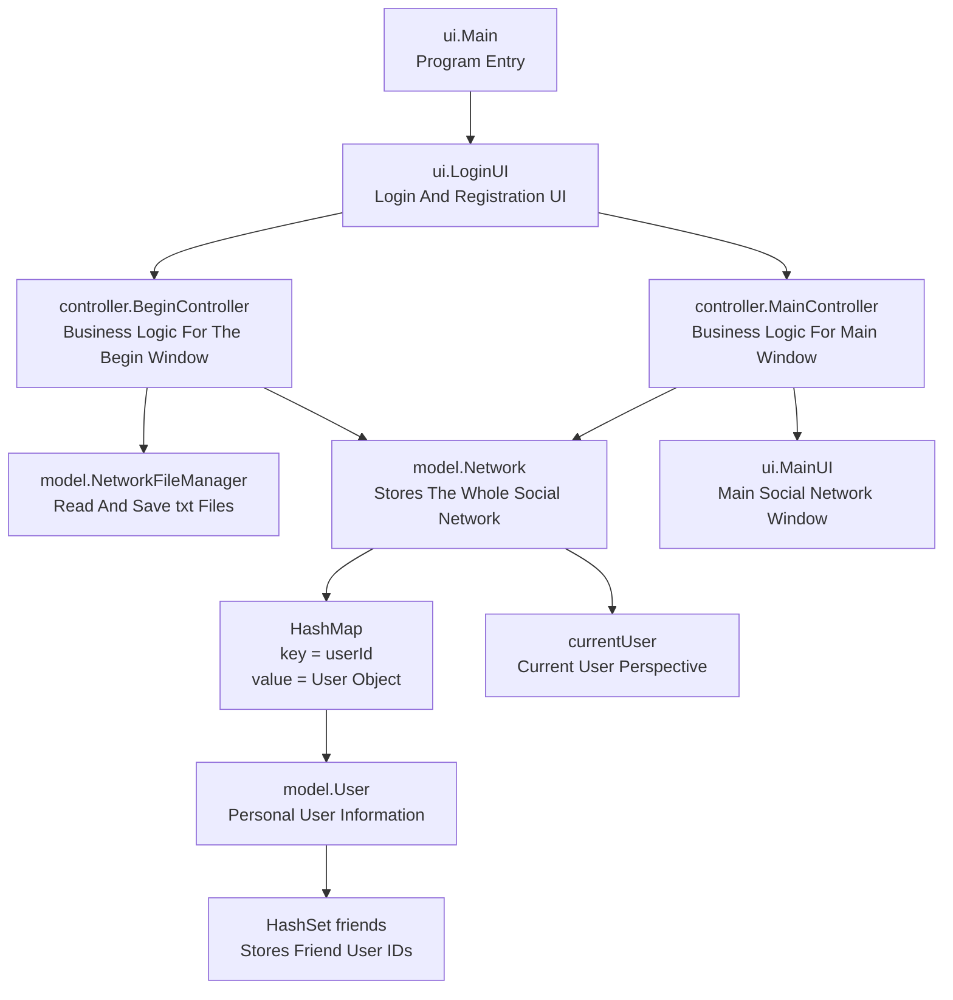

# group_work

## 6.6

We have built the basic framework of `User` and `Network`. The next step is to implement some real functions, starting with user registration and login.

## 6.7

### File Reading And Storage

At this stage we were still clarifying what the ID should be used for. The first confusion was that the hash table did not seem to need an ID if username was used as the key, but the `User` class still had a user ID. We also wanted to support searching users by username and by ID, so the role of ID needed to be clarified.

After reviewing file-related knowledge, we created a `data` folder so that the program can save and reload previous `Network` data. The file naming rule was first designed as:

```text
network-ID.txt
```

This file stores the whole social network, including the network ID, the current user, all user information, and all friendship relationships. When the program starts, it can load the whole social network from this file. When the program ends or the user chooses to save, the current social network can be written back into the same file.

This design makes the saved data easy for the teacher to inspect. The teacher can open the text file directly and check whether user information and friendships have been saved correctly. Using a relative path also avoids depending on an absolute path from one computer.

A useful explanation for the presentation or report is:

```text
The program does not use network programming. Instead, all users are stored in one local social network file, and the current user can be switched to simulate different user perspectives.
```

This sentence explains that the project does not use real network programming. Instead, it uses a local file to store all users and switches the current user to simulate different user perspectives. This keeps the design consistent with the assignment scope.

In `NetworkFileManager`, the file format was designed with several clear sections:

```text
NETWORK_ID
0

CURRENT_USER
0

USERS
userId|username|password|homeTown|workPlace

FRIENDSHIPS
userId1|userId2
```

The main question then became how the file content should connect with the objects in memory: how information is passed, how it is saved, and how it is read back.

The reading strategy is "check, then read". When reading the file, the program first checks whether the current line is `NETWORK_ID`, `CURRENT_USER`, `USERS`, or `FRIENDSHIPS`. After the current section is confirmed, the program reads the following lines according to that section's format.

This approach has several advantages. The logic is clear, and the program does not mix current-user data, user profile data, and friendship data together. It also matches the in-memory data structures:

```text
USERS       -> User objects stored in HashMap
FRIENDSHIPS -> friend IDs stored in each User object's HashSet
```

If the project later adds `POSTS` or `LIKES`, a new section can be added without redesigning the old format.

The reason for choosing a `.txt` file is that it is simple and suitable for structured data in this project. We only need to save user information and friend relationships, so a text file is enough at this stage. Other formats could be considered later, but they are not necessary now.

The saving logic was then expanded so that one social network corresponds to one text file, and all social network files are placed in the `data` folder. Instead of using a network name as the filename, we use the network ID. For example, if the network ID is `0`, the program generates:

```text
data/network-0.txt
```

With this design, the program can save multiple social networks instead of only one fixed file. Loading works in the same way: the program finds the matching file by network ID and restores it into a `Network` object.

Related methods at this stage were:

```text
buildNetworkFilePath(networkId)
saveNetwork(network)
saveNetwork(network, networkId)
loadNetwork(networkId)
```

A simple `NetworkFileManagerTester` was also created. The test creates a network containing `eva` and `frank`, saves it as `network-ID.txt`, reads it back, and checks the network ID, current user, total user count, and friend count.

One issue discovered at this stage was friendship duplication. In memory, friendship is two-way. If the program directly writes every user's friend set, it may save both `eva|frank` and `frank|eva`. This does not break loading because `addEachOther` can restore the relationship, but the file looks duplicated. A later improvement should save each friendship only once.

### UI

For Java Swing UI, we roughly follow this order:

```text
1. Set basic window information.
2. Create the panel.
3. Create components and add them to the panel.
4. Add the panel to the window.
5. Show the window at the end.
```

We use this order because it is easier to learn GUI programming step by step. Building one component and adding it before moving to the next component makes the UI easier to debug and easier to read.

One important rule is that the window should be shown at the end.

## 6.8

### Notes

We clarified the meaning of `User ID`. The ID is like an identity number for each user. It is unique and cannot be repeated. When a user is registered, the system automatically generates a unique ID and stores it inside the `User` object.

In the same social network, different users may have the same username, hometown, or workplace. However, every user ID must be different.

Therefore, the key of the hash table in `Network` was changed to `userId`:

```text
HashMap<Integer, User>
```

This means:

```text
key = userId
value = User object
```

At the same time, the friend collection inside `User` was changed from storing usernames to storing user IDs:

```text
HashSet<Integer> friends
```

With this design, users with the same name do not overwrite each other. Adding friends, removing friends, and saving friendships all use ID internally. Some name-based methods are still kept for convenience, but if a name matches multiple users, the program asks the user to use the ID instead to avoid ambiguity.

The file format was also changed to the ID-based version:

```text
NETWORK_ID
0

CURRENT_USER
0

USERS
0|alice|alice123|Dundee|University of Dundee
1|alice|anotherPassword|London|Tech Company

FRIENDSHIPS
0|1
```

The design logic is now clear: ID is the unique identity, while username is only display information. Username can be duplicated, but user ID cannot.

The login logic was also changed to use `userId` and `password`, instead of `username` and `password`. Since username can now be duplicated, username-based login would be ambiguous. Username can still be used for display or searching matching IDs, but accurate login and relationship operations should use ID.

In the future, other login methods such as email, phone number, or social account could be added by extending the `User` class. For now, user ID and password are enough for this assignment.

The methods were also reorganized into categories, which made the code more readable.

### Files

After changing the relationship between name and ID, the unique identity of a social network also became its ID rather than its name. Each social network has a unique network ID. The program automatically generates this ID and stores it inside the `Network` object.

When saving a network, the filename is:

```text
data/network-ID.txt
```

Therefore, file saving, file reading, file format, and login code all needed to be updated together.

This synchronization is now complete. The `Network` object has its own `networkId`, and saving automatically generates the file path:

```text
data/network-ID.txt
```

The file content now also includes the `NETWORK_ID` section. User login still uses `userId` and `password`, while social network file loading uses `networkId`.

### 6.8 Development Order Record

The main work today was not adding a new feature. Instead, we reorganized our understanding of IDs.

First, we paused UI development and confirmed the meaning of `User ID`. Previously, username and user ID were mixed together in our thinking. We then clarified that username is only a display name and can be duplicated, while user ID is the true unique identity in the system.

Second, the main key in `Network` was changed from username to user ID:

```text
HashMap<Integer, User>
```

This change is important. If username remained the key, two users with the same name could cause one user to overwrite another user in the hash table, making the whole network data unreliable.

Third, the friend collection inside `User` was changed from storing usernames to storing user IDs:

```text
HashSet<Integer> friends
```

This prevents friend relationships from being affected by duplicated names. For example, even if two users are both called `alice`, the system can still tell which two users are friends.

Fourth, the login logic was updated. Login now only uses `userId` and `password`, not `username` and `password`. If this was not changed, the UI login would fail after duplicated usernames became allowed, because the system would not know which user was trying to log in.

Fifth, the file reading and saving logic was updated. Since the unique user identity is `userId` and the unique network identity is `networkId`, both the filename and file content need to follow this rule:

```text
data/network-ID.txt
```

The file also includes the `NETWORK_ID` section to save the ID of the `Network` object itself. After reading a file, not only user information but also the network number can be restored.

Sixth, we found a problem with saving friendship relationships. Since friendships are two-way in memory, directly traversing every user's friends could save:

```text
0|1
1|0
```

These two lines represent the same friendship. Writing both makes the file look strange. Later, the saving logic was optimized to save only one side, such as the line with the smaller user ID first:

```text
0|1
```

When reading the file, the program calls `addEachOther` to restore it as a two-way friendship in memory. This makes the file cleaner and the logic clearer.

Seventh, we returned to UI work and started learning `GridBagLayout`. At this point, the focus was still understanding layout managers, not writing every page at once. The plan was to first make `LoginUI` a basic visible window, and then bind components and controller events step by step.

### Problems Found Today

The first problem was treating username as the unique identity. This looked fine when duplicated usernames were not allowed, but once duplicated usernames became possible, the hash table key, login, adding friends, and file saving were all affected.

The second problem was that file saving did not completely follow the data structure changes at first. If the in-memory logic uses IDs, the file must also use IDs. Otherwise, runtime data and saved data will become inconsistent.

The third problem was duplicated two-way friendships in saved files. A friendship should be two-way in memory, but the file does not need to write both directions. Saving one line and restoring two-way relationships during loading is more reasonable.

The fourth problem was that the UI still had the old idea of `Network Name`. Now the unique identity of a network is `networkId`, so the login UI should use `Network ID`, not `Network Name`.

### Improvements Today

The responsibilities of `User ID`, `Network ID`, and `username` are now clearer:

```text
userId    = unique identity of a user
networkId = unique identity of a social network file
username  = display name of a user, can be duplicated
```

The underlying data structure of `Network` is also more reasonable:

```text
HashMap<Integer, User>
```

The friend relationship structure is:

```text
HashSet<Integer>
```

This better matches the data-structure focus of the project and makes it easier to explain why we chose hash tables and hash sets.

The login logic is clearer now. User ID avoids duplicated-name ambiguity, while username is only used for display and helper search.

File saving is cleaner. One `Network` corresponds to one `network-ID.txt` file, and friendship relationships are saved only once before being restored as two-way relationships during loading.

`TemporaryTester` passed the basic tests at this stage, which means creating users, login, friendship relationships, filtering, and basic file saving/loading did not obviously break after the ID redesign.

## 6.9

### Current Code Architecture Diagram

The project is organized roughly according to MVC. We do not want to encapsulate just for the sake of encapsulation. The responsibilities of UI, Controller, and Model should be clear, but the code should still remain readable for beginners.



In words:

`LoginUI` is responsible for the login window, registration window, buttons, input fields, and pop-up messages.

`BeginController` is responsible for loading an existing social network, checking user ID, checking password, and registering a new social network.

`NetworkFileManager` is responsible for saving a `Network` object to a text file and restoring a `Network` object from a text file.

`Network` is responsible for storing all `User` objects, the current user, friendship relationships, and filtering logic.

`User` is responsible for storing one user's information and that user's friend ID set.

At this point, `MainUI` and `MainController` were still only a framework. The next step was not to rush into many functions, but to decide what the main window should look like.

### Main Window Design Discussion

The main window should not be a complex web-style page. It also does not need to behave like a full real chat application. A more reasonable direction is a simple contact-list interface, similar to a phone contacts app or a WeChat contact list.

After opening the main window, the user should first see which social network they are in and which user is currently logged in. The top area can show:

```text
Social Network
Network ID: 0        Current User: eva (ID 0)
```

The middle area mainly displays a user list. It can first display the current user's friends, and later switch to all users in the network. Since this is a social network program, showing "My Friends" first feels more natural.

A friend could be displayed like this:

```text
1    frank    Glasgow
```

Or with slightly richer information:

```text
ID: 1    Name: frank    Home: Glasgow    Work: Tech Company
```

The main window should not show too much text at once. Its job is to let the user see which users exist, not to display all details for every user at the same time.

When the user clicks a person, a personal information window should pop up. This window can show:

```text
User ID
Username
Hometown
Workplace
Friend count
Friend list
```

Later functions can also be placed in this personal information window:

```text
Add Friend
Remove Friend
View Mutual Friends
View Friends Of Friends
```

This keeps the main window clean, while the detail window handles detailed information. The logic is similar to a contact list: the list shows contacts, and clicking a contact shows the details.

### Initial Main Window Structure

Before coding, the main window can be designed like this:

```text
+------------------------------------------------+
| Social Network                                 |
| Network ID: 0        Current User: eva (ID 0)  |
+------------------------------------------------+
|                                                |
|  Search / Filter: [____________________]       |
|                                                |
|  Friends                                       |
|  +------------------------------------------+  |
|  | 1  frank          Glasgow                |  |
|  | 2  alice          Dundee                 |  |
|  | 3  bob            London                 |  |
|  +------------------------------------------+  |
|                                                |
+------------------------------------------------+
| Add User | Add Friend | Remove Friend | Save   |
+------------------------------------------------+
```

When coding later, the order should be:

1. Let `MainUI` display an empty window.
2. Let `MainUI` display current user information.
3. Let `MainUI` display the friend list.
4. Click a friend and show a personal information window.
5. Then consider add friend, remove friend, friend filtering, and other buttons.

This order is comfortable because it avoids putting all functions into the window at once. It also follows our current approach: build the structure first, then slowly add behavior.

### MainUI Implementation Record

We started implementing `MainUI` step by step, without putting all components and functions into it at once.

First, we created a basic main window:

```java
public class MainUI extends JFrame
```

The window size was temporarily set to:

```text
480 x 620
```

This size looked like a vertical contact-list window, matching the original contact-list idea.

Second, the outer container of `MainUI` was set to `BorderLayout`:

```text
NORTH  top area
CENTER middle area
SOUTH  bottom area
```

This makes the overall structure clear. The outer layer does not need a huge `GridBagLayout`, because that would make the code crowded and harder to read.

Third, we started building the top area. It shows:

```text
Social Network
Network ID
Current User
```

At first, these values were placeholders because `MainUI` had not yet received the real `Network` object and current user information. Later, after `MainController` was connected, `Unknown` could be replaced with real data.

Fourth, we started building the middle area. It contains:

```text
Search box
Friend list
Scroll pane
```

The list first used:

```java
JList
```

This was suitable for learning because `JList` is simpler than `JTable` and looks like a contact list. At that time, the list only had placeholder content, which would later be replaced with real network data.

### Current Problem

At this point, `MainUI` already had the basic shape of a contact-list UI, but the interface felt crowded. This issue was recorded for later optimization.

Possible improvements included:

1. Increase the window width.
2. Add more spacing between the title and current-user information.
3. Make the `Search / Filter` row less crowded.
4. Add space between the `Friends` label and the list.
5. Let the middle list area naturally occupy more space.
6. Standardize the bottom button sizes and spacing.

The visual problem was not urgent yet because real data had not been fully connected. A better order was:

1. Connect `MainUI` and `MainController`.
2. Let `MainUI` display current user information.
3. Let `MainUI` display the current user's friends.
4. Then adjust spacing, fonts, and overall layout.

In other words, the focus was first to make the structure work, and then to make the interface look comfortable.

### MainUI Bottom Area Layout Correction

We later optimized the bottom button area. At first, we tried using `GridBagLayout` directly in the bottom area, but a problem appeared: the left button looked longer than the right button, and the layout looked uneven.

The reason was not the button itself. `GridBagLayout` calculates column width according to component preferred size. A button with longer text, such as:

```text
Remove Friend
```

is naturally wider than:

```text
Save
```

So the left column became wider, while the right column became shorter. Even with `weightx`, the visual result was still not neat.

We then changed the bottom area into a clearer nested structure:

```text
southPanel
├── buttonPanel
└── logoutPanel
```

The main buttons were placed in:

```text
buttonPanel
```

This panel used:

```java
GridLayout
```

So the buttons automatically had the same width and height.

The `Logout` button was placed in:

```text
logoutPanel
```

`logoutPanel` used `BorderLayout`, with `logoutButton` placed in `CENTER`. This allowed us to add top spacing above logout without breaking the button style.

The final layout decision for the bottom area was:

```text
SOUTH outer area: BorderLayout
Main buttons: GridLayout
Logout area: BorderLayout
```

This taught us that not every area needs `GridBagLayout`. `GridBagLayout` is useful for precise positioning, but for a button area where equal size is more important, `GridLayout` is simpler and more stable.

### 6.9 Development Review

The later work on 6.9 mainly focused on `MainUI` and network ID. Overall, we were not only writing code. We were also continuously correcting what should be placed where.

The first major change was the network ID. Earlier, the network ID used a timestamp. This was unlikely to repeat, but it was too long and hard for the user to type. It was also not suitable for demonstration.

After discussion, we changed the network ID to:

```text
date + daily index
```

For example:

```text
20260609-0
```

This shows the creation date clearly, and multiple networks created on the same day can still be distinguished.

To support the new format, `networkId` was changed from `long` to `String`. This affected file saving, file loading, login, and main-window display. The filename became:

```text
network-20260609-0.txt
```

The file content was also updated:

```text
NETWORK_ID
20260609-0
```

One small problem was that after changing the code to the new ID format, the old `network-0.txt` file also needed to be updated. Otherwise, the code logic and real files in the `data` folder would not match. The old file was migrated to:

```text
network-20260609-0.txt
```

and the internal `NETWORK_ID` was also changed to `20260609-0`.

### MainController Receives Network

The second important change was clarifying the responsibility of `MainController`.

We had a debate: should `MainUI` directly receive data such as `networkId`, `currentUserId`, and `username`, or should it receive a `MainController`?

At first, directly receiving display values seemed acceptable because showing values is not complicated business logic. However, as development continued, `MainUI` needed to render the user list from the whole `Network`, handle user-button clicks, view user information, save the network, and manage friends.

Therefore, the final decision was:

```text
BeginController handles login and registration.
Login or registration returns a Network object.
LoginUI creates MainController.
MainController receives the full Network object.
MainUI receives MainController.
```

The flow became:

```text
LoginUI
  -> BeginController
  -> Network
  -> MainController
  -> MainUI
```

This way, `MainUI` does not need to store many separate pieces of data. If it needs to find users, find friends, or save the network, it can go through `MainController`.

### Contact List Changed From Text To Buttons

The third important change was how the contact list is displayed.

At first, we used:

```java
JList<String>
```

This was simple and allowed user information to be displayed line by line. However, it did not feel like a real contact list. The desired effect was:

```text
Each user is a button.
Clicking the button opens that user's detailed information.
```

This fits the meaning of a button better.

So the middle area was changed to:

```text
JPanel + BoxLayout.Y_AXIS + JScrollPane
```

`BoxLayout` can be understood as:

```text
Let components line up in one direction.
```

We used:

```java
BoxLayout.Y_AXIS
```

which means components are arranged from top to bottom. The outer `JScrollPane` allows scrolling when there are many users.

### Logic Behind User Buttons

At first, buttons were created from strings. However, if a button only stores a display string, clicking it later becomes inconvenient. We need to know which `userId` is behind the button, instead of trying to parse the ID from the string.

Therefore, the logic was changed:

```text
MainController provides User objects.
MainUI loops through User objects.
Each User object creates one button.
Each button naturally knows its userId.
```

After clicking a button:

```text
MainUI sends userId to MainController.
MainController finds the User object through Network.
MainUI creates a new user information window.
```

The user information window currently displays:

```text
User ID
Username
Hometown
Workplace
Friend count
Friend list
```

This made `MainUI` feel more like a contact list instead of a static text display.

### ArrayList, HashSet, And HashMap Discussion

We also had an important data structure discussion.

The model layer mainly uses:

```text
HashMap<Integer, User>
HashSet<Integer>
```

When `ArrayList<User>` appeared in `MainController`, we discussed why it was not a `HashSet` or `HashMap`.

The conclusion was:

```text
HashMap is good for quickly finding a User by userId.
HashSet is good for storing unique friend IDs.
ArrayList is good for displaying users in a stable UI order.
```

So:

```text
Storage and lookup: HashMap
Friend relationships: HashSet
UI display order: ArrayList
```

If we want to find a user by ID, `HashMap` is best because it stores:

```text
key = userId
value = User object
```

This logic already exists inside `Network`. `MainController.getUserById(...)` is essentially asking `Network` to find a user through the hash table.

However, if we want to display all users in the UI, we need to go through the users and display them in a stable order, such as ascending user ID. Therefore, `MainController` temporarily uses `ArrayList` for sorting and display.

The final conclusion:

```text
Use ArrayList when rendering lists.
Use HashMap when clicking a button and finding one specific user.
```

This is not inconsistent style. It is using different data structures for different jobs.

### Problems And Corrections Today

The first problem was that the network ID was too long. A timestamp is unique, but it is hard for users to type. It was changed to date plus index.

The second problem was changing code but forgetting to update data files. After the network ID rule changed, the filenames and internal `NETWORK_ID` values also needed to be updated.

The third problem was that `MainUI` initially received scattered display values. This works for simple display, but once the main window needs to render users and handle clicks, it is not enough. So `MainController` now receives the complete `Network`.

The fourth problem was that `JList` is simple but not contact-list-like enough. It was changed so that each user is displayed as a `JButton`.

The fifth problem was that if a button only stores a string, it is hard to know which `User` it represents after clicking. This was fixed by creating buttons from `User` objects.

The sixth problem was that some code was not beginner-friendly, such as lambda expressions and very long string concatenation. Later, the code was expanded into clearer steps.

The seventh problem was a Swing repaint artifact in the bottom button area. We tried `setOpaque(true)`, disabling focus painting, and changing layouts. The issue looked like a Windows Swing repaint artifact. It disappeared after clicking and did not affect functionality, so it was recorded for later UI polishing.

### Current Status

At this point, the program can roughly complete this flow:

```text
Login or register
Load or create Network
MainController receives Network
MainUI displays current Network and currentUser
MainUI renders all users as buttons
Click a user button
Open user information window
```

The natural next direction is to continue adding button behavior:

```text
Save
Logout
Add Friend
Remove Friend
Add User
Remove User
```

The next step should not implement everything at once. A reasonable order is to first make a simple complete button, such as `Save` or `Logout`, and then implement friend operations that affect the `Network` data structure.

## 6.10

### Main Window Split Into Two Views

An important understanding today was that the assignment core is not simply "an administrator views all users". It is more about the `current user` acting as a social network user and viewing their friends, friends of friends, common friends, and recommended friends.

The old main window looked a little like an all-seeing management view:

```text
Show all users
Add user
Remove user
Add friend
Remove friend
Save network
```

These features are not wrong, because the assignment extras mention adding and removing users. However, they are more like a `Network Manager` view than a normal social user's view.

So we did not discard the old `MainUI`. Instead, we placed it inside a larger left-right layout:

```text
mainPanel(BorderLayout)
├── NORTH: Network ID / Current User information
└── CENTER: contentPanel(GridLayout 1 row, 2 columns)
    ├── LEFT: Current User View
    └── RIGHT: Network Manager
```

The left side is the current user view, showing the current user's profile and friend list. The right side is the social network management view, showing all users, search, add/remove user, add/remove friend, save, and logout.

This change is important because the UI meaning becomes clearer:

```text
Current User View = core assignment user perspective
Network Manager   = extra management functions
```

### Current User View

The left area is called:

```text
Current User View
```

It displays:

```text
User ID
Username
Hometown
Workplace
Friend Count
```

The `My Friends` list displays each friend as a button. Clicking a friend opens that user's information window. This better matches the assignment requirement to view a friend and that friend's friend information.

At this point, the left side still needed friend filtering, common friends, and friend recommendations. These became the next core tasks.

### Network Manager View

The right area is called:

```text
Network Manager
```

It displays all users in the network. The title was changed from `Users` to:

```text
All Users
```

This avoids confusion with the left side's `My Friends`.

The right side currently supports:

```text
Add User
Remove User
Add Friend
Remove Friend
Save
Logout
Search / Filter
Click a user to view information
```

The bottom buttons were organized into a 3-row, 2-column layout:

```text
Add User      Add Friend
Remove User   Remove Friend
Save          Logout
```

This is more compact than putting `Logout` on a separate row, and it fits the wider two-column main window better.

### Search And Filtering

The right-side search bar is:

```text
Search / Filter: [__________] [Name] [Search]
```

The combo box supports:

```text
ID
Name
Workplace
Hometown
```

The search logic is placed in `MainController`:

```text
filterUsers(keyword, filterType)
```

Rules:

```text
ID        = exact user ID match
Name      = username contains keyword
Workplace = workplace contains keyword
Hometown  = hometown contains keyword
```

After clicking `Search`, `MainUI` refreshes the right-side `All Users` list. After clicking `Reset`, the input field is cleared, the combo box returns to `Name`, and all users are shown again.

This again clarifies the role of `ArrayList`: filtering returns `ArrayList<User>` for UI display order, while the underlying lookup still relies on `HashMap<Integer, User>` inside `Network`.

### Button Business Logic Completed

The basic button business logic in `MainUI` is mostly connected.

`Add User`:

```text
Open a window for username, password, hometown, and workplace.
Call MainController.createNewUser(...).
Network automatically generates a new userId.
Refresh the main window after success.
```

`Remove User`:

```text
Open a window for userId.
Do not allow removing currentUser.
Remove the userId from all friend lists.
Refresh the main window after success.
```

`Add Friend`:

```text
Open a window for target userId.
Call MainController.addFriendToCurrentUser(...).
Internally call Network.addEachOther(...).
```

`Remove Friend`:

```text
Open a window for target userId.
Call MainController.removeFriendFromCurrentUser(...).
Internally call Network.removeEachOther(...).
```

`Save`:

```text
Call NetworkFileManager.saveNetwork(network).
Save to data/network-ID.txt.
```

`Logout`:

```text
Show a confirmation dialog.
Close MainUI after confirmation.
Open LoginUI again.
```

These functions do not automatically save after every operation. If the user changes the network and wants to write it to the file, they need to click `Save`. This makes the responsibility of the `Save` button clear.

### UI Layout Record

The current `MainUI` layout is roughly:

```text
outer mainPanel: BorderLayout
top topPanel: GridLayout(2, 1)
left-right contentPanel: GridLayout(1, 2, 16, 0)

left currentUserPanel: BorderLayout
current user profile: GridLayout(5, 1)
current user friend list: BoxLayout.Y_AXIS + JScrollPane

right networkManagerPanel: BorderLayout
search and all-user area: GridBagLayout
all user button list: BoxLayout.Y_AXIS + JScrollPane
bottom buttons: GridLayout(3, 2, 8, 8)
```

Both main areas use `TitledBorder`, which is a titled border object set on a `JPanel`, not a separate Swing component.

The window size was changed from the earlier vertical contact-list style to:

```text
960 x 720
```

This is because the main window now has two views. If the old narrow size remained, the UI would feel too crowded.

### Current Completion Judgment

The basic project framework is now mostly complete. Important foundations include:

```text
User / Network / NetworkFileManager / Controller / UI responsibility split
HashMap<Integer, User> for user storage
HashSet<Integer> for friend IDs
txt file reading and saving
Login to an existing social network
Register a new social network
MainUI with two views
Add/remove users
Add/remove friends
Save and logout
Filter all users on the right side
Click users to view profile and friend list
```

However, strictly following the assignment, the project should not be considered fully finished yet. The next important work should return to the current user view:

1. Filter the current user's own friends, such as by hometown or workplace.
2. When viewing a friend, show common friends.
3. Recommend friends from friends of friends who share hometown or workplace and are not already friends.
4. Add more complete testing records and README/report explanations.

So the current conclusion is:

```text
The basic MVC framework and main UI framework are mostly complete.
The Network Manager side is already fairly complete.
The next stage should focus on the assignment core: Current User View, friend filtering, common friends, and friend recommendations.
```

This also shows that the hardest architectural part is mostly done. The remaining tasks are more like adding and polishing functions on a stable framework.

## Program Usage Guide

### Start The Program

The program entry is:

```text
GroupProject/src/ui/Main.java
```

After running, the program opens `LoginUI`. The user can either load an existing social network or register a new social network.

### Register A New Social Network

Click:

```text
Register New Network
```

The program opens a registration window. The user needs to enter:

```text
Username
Password
Confirm Password
Hometown
Workplace
```

After registration succeeds, the program creates a new `Network` object and automatically generates a network ID. The network ID uses:

```text
date + daily index
```

For example:

```text
20260610-0
```

The first user's `userId` defaults to:

```text
0
```

After registration succeeds, the program automatically opens the `MainUI` main window.

### Login To An Existing Social Network

To log in to an existing social network, enter:

```text
Network ID
User ID
Password
```

For example, if the filename is:

```text
network-20260610-0.txt
```

then the `Network ID` should be:

```text
20260610-0
```

Login does not use username. It uses `userId` because usernames can be duplicated, while user ID is the unique identity.

After login succeeds, the program reads the whole social network from the matching text file and opens the main window.

### Main Window Structure

`MainUI` has two main parts:

```text
Left: Current User View
Right: Network Manager
```

The left side is the current logged-in user's perspective. The right side is the management perspective for the whole social network.

### Current User View

The left side shows the current user's own information:

```text
User ID
Username
Hometown
Workplace
Friend Count
```

The `My Friends` area shows the current user's friend list. Each friend is displayed as a button:

```text
ID: 1    frank    Glasgow
```

Clicking a friend button opens that friend's information window. The information window shows:

```text
User ID
Username
Hometown
Workplace
Friend Count
Friend list
```

In this window, the user can also see that friend's friends. This means the current user can view friends of friends, but the program avoids unlimited nested navigation.

The `My Friends` area also has its own filter:

```text
Search / Filter: [keyword] [Name] [Search]
```

This filter only searches the current user's friends, not all users in the network. The combo box supports:

```text
ID
Name
Workplace
Hometown
```

In other words:

```text
Left side filters currentUser's friends.
Right side filters all users in Network.
```

This keeps the two views' responsibilities clear.

The left side also has a friend recommendation area:

```text
Friend Recommendations
```

The program searches the current user's friends of friends. If a person is not already the current user's friend and shares the same hometown or workplace, that person is added to the recommendation list.

Each recommended friend has:

```text
Add Friend
```

Clicking it adds that recommended user as the current user's friend.

### Network Manager

The right side shows all users in the social network, which is the `All Users` list. This is more like an administrator view for checking and managing the whole network.

Each user is also displayed as a button:

```text
ID: 1    frank    Home: Glasgow    Work: Tech Company
```

Clicking a user button opens the user information window.

The user information window displays:

```text
User ID
Username
Hometown
Workplace
Friend Count
Friend list
Common Friends with Current User
```

`Common Friends with Current User` means the common friends between the current logged-in user and the selected user. If the selected user is the current user, this common-friend area is not shown.

### Search And Filter All Users

The right-side search bar is:

```text
Search / Filter: [keyword] [Name] [Search]
```

The combo box supports:

```text
ID
Name
Workplace
Hometown
```

Usage:

1. Enter a keyword in the text field.
2. Select a search type from the combo box.
3. Click `Search`.

Current search rules:

```text
ID        = exact user ID match
Name      = username contains keyword
Workplace = workplace contains keyword
Hometown  = hometown contains keyword
```

To show all users again, click:

```text
Reset
```

`Reset` clears the search field, changes the combo box back to `Name`, and displays all users again.

### Add User

Click:

```text
Add User
```

The program opens an add-user window. The user needs to enter:

```text
Username
Password
Hometown
Workplace
```

After confirmation, the program calls `Network.createUser(...)` to create the user and automatically assigns a new `userId`. After success, the main window refreshes and the new user appears in the right-side `All Users` list.

Note: Adding a user only changes the `Network` object in memory. To save it to the text file, click `Save`.

### Remove User

Click:

```text
Remove User
```

The program opens a remove-user window, and the user enters the target `userId`.

Rules:

```text
Cannot remove the current logged-in user.
Target user must exist.
When a user is removed, that userId is also removed from all friend lists.
```

This avoids a situation where a user no longer exists but other users' friend lists still contain that ID.

After removal succeeds, the main window refreshes.

### Add Friend

Click:

```text
Add Friend
```

The program opens an add-friend window. The user enters the target user's `userId`.

The program adds that target user as the current user's friend. Internally it calls:

```text
Network.addEachOther(...)
```

So the friendship is two-way:

```text
I add you as a friend.
You also have me as a friend.
```

Checks:

```text
Cannot add yourself.
Target user must exist.
Cannot add an already existing friend again.
```

### Remove Friend

Click:

```text
Remove Friend
```

The program opens a remove-friend window. The user enters the target friend's `userId`.

The program calls:

```text
Network.removeEachOther(...)
```

So removing is also two-way:

```text
I remove you.
You also remove me.
```

Checks:

```text
Cannot remove yourself.
Target user must exist.
Target user must already be the current user's friend.
```

### Save Social Network

Click:

```text
Save
```

The program saves the entire current `Network` object to a text file. The filename format is:

```text
data/network-ID.txt
```

For example:

```text
data/network-20260610-0.txt
```

Saved content includes:

```text
Network ID
Current user ID
All user information
Friendship relationships
```

Friendships are saved only once in the file, avoiding duplicate pairs such as:

```text
0|1
1|0
```

When the program reads the file, it restores the relationship as a two-way friendship in memory.

### Logout

Click:

```text
Logout
```

The program shows a confirmation dialog. If the user chooses `Yes`, it closes the current main window and opens the login window again.

Logout does not automatically save. If the user changed the social network, they should click `Save` before logging out.

### Current Remaining Work

The program can already handle basic loading, login, display, adding/removing users, adding/removing friends, searching, saving, logout, current-user friend filtering, common friends, and friend recommendations.

Remaining work mainly includes:

1. More complete test records.
2. Save-and-reload verification.
3. Better summaries of data structures and features for README, report, and presentation.
4. Further UI polishing based on demonstration needs.

### Current Testing Status

`NetworkTester` was run again to check whether the lower-level `Network` and file read/write logic still work.

The test result was:

```text
Passed: 55
Failed: 0
Total: 55
All tests passed
```

This means user search, login checks, friendship relationships, filtering, friends-of-friends filtering, file saving, and file loading currently have no obvious lower-level problems.

However, this tester mainly checks the Model layer and file manager logic. The Swing UI is still mainly verified manually by running the program.
