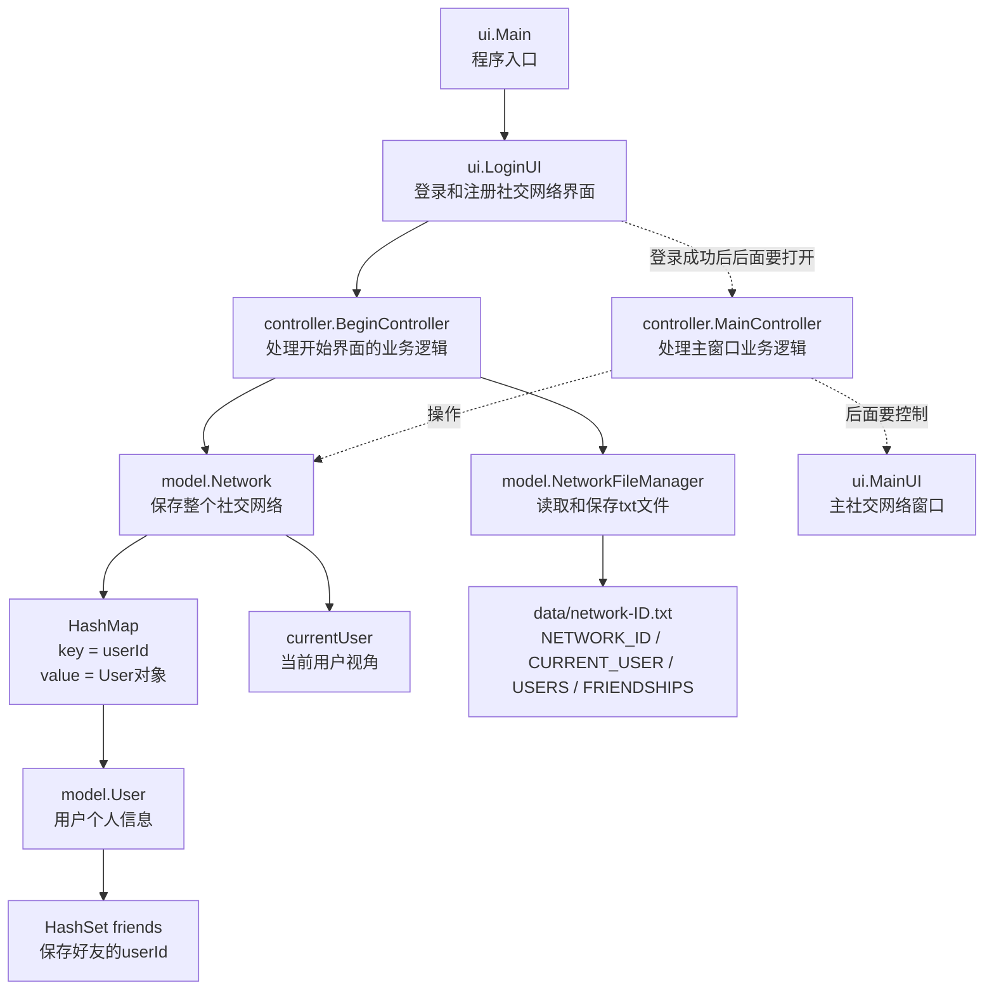

# group_work

## 6.6
现在已经写出来了User和NetWork的基本框架了，接下来我们要实现一些功能了。首先我们要实现用户的注册和登录功能。

## 6.7

### 文件读取和存储
不是老哥啊，这个ID到底是用来干啥的啊，我的哈希表用不到，但是我的User类里面还要去写这个ID啊。我既要实现用用户名查询并且提取用户，还要使用ID去查询提取用户。What can I say?

大早上，现在我重新学习了文件有关的知识，为了保证我们每次能够加载或者是保存之前的NetWork的数据，我们创建了data文件夹。现在最终采用的文件命名规则是network-ID.txt，这个文件用来保存整个社交网络的信息，包括社交网络ID、当前用户、所有用户信息和好友关系。每次程序启动的时候，我们可以从这个文件里面加载整个社交网络；每次程序结束或者用户选择保存的时候，我们可以把当前社交网络重新保存到这个文件里面。

这样做的话老师就可以去查看这个文件里面的内容，看看我们是否正确的保存了用户的信息了。使用相对路径不用访问电脑上的文件。

描述的时候可以进行这样的描述:

```text
The program does not use network programming. Instead, all users are stored in one local social network file, and the current user can be switched to simulate different user perspectives.
```

这句话既可以放在presentation里面，也可以放在report里面，反正就是要说明我们这个程序没有使用网络编程，而是使用了一个本地的社交网络文件来存储所有的用户，并且可以切换当前用户来模拟不同用户的视角。逻辑自洽。

我在NetWorkFileManager里面规定了一个文件的格式，大体分成三个部分：

```text
NETWORK_ID
0

CURRENT_USER
0

USERS
userId|username|password|homeTown|workPlace

FRIENDSHIPS
userId1|userId2
```

现在问题在于二者怎么相互产生关联，信息怎么传递，怎么保存怎么读取。

我觉得“检查 + 读取”这个习惯还不错。比如读取文件的时候，先检查当前这一行是不是NETWORK_ID、CURRENT_USER、USERS或者FRIENDSHIPS，确认现在处于哪一个部分，然后再按照这个部分对应的格式去读取下一行信息。

这样做的好处是逻辑比较清楚，不会把当前用户、用户资料和好友关系混在一起读。它也和我们内存里面的数据结构对应得上：USERS对应HashMap里面的User对象，FRIENDSHIPS对应User里面的HashSet好友列表。后期如果要加POSTS或者LIKES，也可以继续加新的部分，而不用推翻原来的文件格式。

选择txt文件的原因是它简单易用，适合存储结构化的数据，而且我们只需要保存用户的信息，不需要保存复杂的数据结构，所以txt文件就足够了。

当然后面我们也可能会考虑其他格式的文件，现在先不考虑这些了。

现在我们又扩展了一下文件保存逻辑：一个社交网络对应一个txt文件，所有社交网络文件都放在data文件夹里面。现在不再使用社交网络名字作为文件名，而是使用社交网络ID。比如如果社交网络ID是0，程序会自动生成：

```text
data/network-0.txt
```

这样我们就不只能保存一个固定文件，而是可以保存多个不同的社交网络。读取的时候也是一样，通过社交网络ID找到对应文件，再把文件恢复成Network对象。

目前相关方法大概是：

```text
buildNetworkFilePath(networkId)
saveNetwork(network)
saveNetwork(network, networkId)
loadNetwork(networkId)
```

我也写了一个简单的NetworkFileManagerTester进行测试。测试内容是创建一个包含eva和frank的社交网络，把它保存成network-ID.txt，然后再读取回来，检查network ID、current user、用户总数和好友数量。

现在还有一个后面可以优化的地方：因为好友关系在内存中是双向的，所以保存的时候会同时写出eva|frank和frank|eva。这个不是严重错误，因为读取的时候addEachOther可以保证关系不会乱，但是文件会有一点重复。后面可以考虑保存好友关系的时候只保存一边。

### UI

Java中这个搞这个UI差不多是这个顺序：

```text
// 1. 设置窗口基本信息
this.setTitle(...);
this.setSize(...);

// 2. 创建 panel
panel = new JPanel(new GridLayout(7, 2));

// 3. 创建组件并 add 到 panel
panel.add(...);

// 4. 把 panel add 到窗口
this.add(panel);

// 5. 最后再显示窗口
this.setVisible(true);
```

我们使用这个顺序进行UI设计，而且我们是弄好一个组件再去弄下一个组件，这样有助于我们去学习GUI，提高代码的阅读性，同时也有助于我们去调试UI，看看每个组件的效果。

我们要注意的是一定要在最后去显示窗口。

## 6.8

### 注意

现在明白了User ID的含义了，ID相当于每一个用户的身份证号码，是唯一的，不会重复的。我们在注册用户的时候，系统会自动生成一个唯一的ID，并且把它保存在User对象里面。在这个社交网络中，可以存在名字相同，家乡相同，工作地点等等相同的不同的用户，但是ID每一个用户是不相同的。

所以我们现在把Network里面的哈希表主键改成了userId：

```text
HashMap<Integer, User>
```

也就是说：

```text
key = userId
value = User对象
```

同时User里面的好友集合也从保存username改成保存userId：

```text
HashSet<Integer> friends
```

这样即使两个用户名字一样，也不会互相覆盖。添加好友、删除好友、保存好友关系的时候，底层都使用ID来处理。为了使用方便，代码里面仍然保留了一些按照名字操作的方法，但是如果这个名字对应多个用户，就会提示需要改用ID，避免误操作。

文件格式也跟着改成ID版本：

```text
NETWORK_ID
0

CURRENT_USER
0

USERS
0|alice|alice123|Dundee|University of Dundee
1|alice|anotherPassword|London|Tech Company

FRIENDSHIPS
0|1
```

现在的设计逻辑是：ID是唯一身份，username只是用户资料里面的显示名字。username可以重复，但是userId不能重复。

登录逻辑也统一改成使用userId和password，不再使用username和password登录。原因是username现在允许重复，如果用username登录会出现歧义。username后面可以用来显示用户信息，或者查询同名用户对应的ID，但是最终登录和建立准确关系都应该使用ID。

当然或许我们也可以使用别的途径去登录，比如邮箱，手机号，社交账号等等，我们可以向用户类添加更多的属性来支持这些登录方式，来扩展程序的多样性。

我们现在整理分类了方法，可读性变好了一点.

### 文件

由于我们修改了name和ID的关系，现在社交网络的唯一标识也不再是名字，而变成了ID了。每个社交网络都有一个唯一的ID，程序会自动生成这个ID，并且把它保存在NetWork对象里面。我们在保存社交网络的时候，文件名也改成了：

```text
data/network-ID.txt
```

所以我们现在需要同步去修改文件保存，文件读取，文件格式，登录的代码了。

现在已经同步完成：Network对象里面有自己的networkId，保存文件的时候会自动按照networkId生成文件名，格式是：

```text
data/network-ID.txt
```

文件内容也增加了NETWORK_ID部分。用户登录仍然使用userId和password，社交网络文件读取使用networkId。

### 6.8开发顺序记录

今天主要不是单纯加新功能，而是把之前关于ID的理解重新理顺了一遍。大概顺序是这样的：

第一步，我们先停下UI的开发，重新确认User ID的含义。之前我一直有点把username和userId混在一起用，后来才明确：username只是用户资料里面的显示名字，可以重复；userId才是系统里面真正唯一的身份标识。

第二步，我们把Network里面的哈希表主键从username改成了userId：

```text
HashMap<Integer, User>
```

这个改动很关键，因为如果继续用username当key，那么两个用户重名的时候，后加入的用户可能会覆盖前面的用户，这样整个社交网络的数据就不可靠了。

第三步，我们把User里面的朋友集合也从保存username改成保存userId：

```text
HashSet<Integer> friends
```

这样好友关系就不会受到重名影响。比如两个用户都叫alice，也不会影响系统判断谁和谁是朋友。

第四步，我们同步修改了登录逻辑。登录现在只能使用userId和password，不能再使用username和password。这个地方之前如果不改，后面UI登录一定会出问题，因为username允许重复以后，系统不知道到底是哪一个用户要登录。

第五步，我们同步修改了文件读取和保存逻辑。因为现在用户唯一标识是userId，社交网络唯一标识是networkId，所以文件名和文件内容都要跟着改：

```text
data/network-ID.txt
```

文件里面也增加了NETWORK_ID部分，用来保存这个Network对象自己的ID。这样读取文件以后，不只是用户信息能恢复，社交网络本身的编号也能恢复。

第六步，我们发现了好友关系保存的一个问题。因为内存里面好友关系是双向的，所以如果直接遍历每个用户的friends，就可能同时保存：

```text
0|1
1|0
```

这两个其实表达的是同一段好友关系，写两遍会让文件看起来很奇怪。后面我们把保存逻辑优化成只保存一边，比如只保存userId较小的那一条：

```text
0|1
```

读取的时候再调用addEachOther，把它恢复成内存中的双向关系。这样文件更干净，逻辑也更清楚。

第七步，我们又回到UI上，开始学习GridBagLayout。这里主要还在理解布局管理器，不急着一次性把所有页面都写完。现在的思路是先把LoginUI做成一个能看的基本窗口，再一步一步把组件和控制器事件绑定上去。

### 今天踩过的坑

最开始的问题是把username当成唯一身份。这个在用户不能重名的时候看起来没问题，但是一旦允许重名，HashMap的key、登录、加好友、文件保存都会受到影响。

第二个问题是文件保存没有完全跟着数据结构一起变化。内存里已经是ID逻辑了，文件也必须同步使用ID，否则程序运行时和保存后的数据会不一致。

第三个问题是双向好友关系容易重复保存。内存里面需要双向，文件里面不一定需要双向重复写。文件只保存一条关系，读取的时候恢复成双向关系，会更合理。

第四个问题是UI里面一开始还残留了Network Name的想法。现在Network的唯一标识已经是networkId，所以登录界面也应该使用Network ID，而不是Network Name。

### 今天优化的地方

现在User ID、Network ID、username三者的职责更加清楚了：

```text
userId = 用户唯一身份
networkId = 社交网络文件唯一身份
username = 用户显示名字，可以重复
```

Network的底层数据结构也更合理了：

```text
HashMap<Integer, User> userNetwork
HashSet<Integer> friends
```

这样更符合我们这个项目强调的数据结构设计，也能更好地解释为什么选择哈希表和哈希集合。

登录逻辑也变得更清楚了：用userId登录可以避免重名歧义，username只负责展示和辅助查询。

文件保存也更干净了：一个Network对应一个`network-ID.txt`文件，好友关系只保存一边，读取的时候再恢复成双向关系。

目前TemporaryTester已经通过了基础测试，说明这次ID逻辑修改以后，创建用户、登录、好友关系、筛选和基础读取保存没有明显崩掉。

## 6.9

### 当前代码架构图

现在项目大体按照MVC的思路去组织，但是我们不想为了封装而封装。也就是说，UI、Controller、Model之间要分清楚职责，但是目前还没有被我搞得乱七八糟的感觉。现在的代码架构大体是这样的：



用文字描述就是：

```text
LoginUI负责登录窗口、注册窗口、按钮、输入框、弹窗。
BeginController负责加载已有社交网络、检查用户ID、核对密码、注册新社交网络。
NetworkFileManager负责把Network对象保存到txt文件，也负责从txt文件恢复Network对象。
Network负责保存所有User对象、当前用户、好友关系和筛选逻辑。
User负责保存单个用户的信息，以及这个用户自己的好友ID集合。
```

目前主窗口相关的`MainUI`和`MainController`还只是空框架。下一步不是急着写一堆功能，而是先确定主窗口长什么样子。

### 主窗口设计讨论

我们设想的主窗口不是复杂的网页式页面，也不需要做得像真正的网络聊天软件那么大。更合理的方向是做成“手机通讯录”或者“微信联系人列表”那样的简单窗口。

主窗口打开以后，用户应该第一眼看到自己所在的社交网络，以及当前登录的是哪一个用户。比如窗口顶部可以显示：

```text
Network ID: 1780911567965
Current User: eva
User ID: 0
```

窗口中间主要显示用户列表。这个列表可以先显示当前用户的好友，也可以后面切换成显示整个社交网络中的所有用户。考虑到我们这是社交网络程序，主界面优先显示“我的好友”更自然。

一个好友在列表里面大概显示成：

```text
0  eva
1  frank
2  alice
```

或者稍微丰富一点：

```text
1  frank    Glasgow
2  alice    Dundee
```

我们先不要在主窗口里堆太多文字。主窗口应该负责“看见有哪些用户”，而不是一次性把每个用户的所有信息都展示出来。

当鼠标点击某一个用户的时候，再弹出一个个人信息窗口。这个个人信息窗口可以显示：

```text
User ID
Username
Home Town
Work Place
Friends Count
```

后面如果要添加功能，也可以把按钮放在个人信息窗口里面，例如：

```text
Add Friend
Remove Friend
View Friends
```

这样主窗口保持干净，个人窗口负责展示细节。这个逻辑比较像通讯录：列表只显示联系人，点击联系人以后才看详细资料。

### 主窗口初步结构

先不写代码的话，主窗口可以先这样设计：

```text
MainUI

顶部：
Network ID
Current User ID
Current Username

中间：
好友列表 / 用户列表

底部：
Add User
Save
Logout
```

点击列表中的用户以后：

```text
UserProfileFrame

User ID
Username
Home Town
Work Place
Friends Count

Close
```

后面我们写代码的时候可以一步一步来：

```text
1. MainUI先显示一个空窗口
2. MainUI显示当前用户信息
3. MainUI显示好友列表
4. 鼠标点击好友，弹出个人信息窗口
5. 再考虑添加好友、删除好友、筛选好友等按钮
```

这个顺序比较舒服，不会一下子把所有功能堆在一个窗口里面，也比较符合我们现在“先把结构写清楚，再慢慢补功能”的节奏。

### MainUI实现记录

现在我们开始真正写MainUI了，但是依旧按照一步一步来的方式去写，不一次性把所有组件和功能全部塞进去。

第一步，我们先创建了一个基础的主窗口：

```text
MainUI extends JFrame
```

窗口大小现在暂时设置成：

```text
450 x 680
```

这个尺寸比较像手机通讯录的竖屏比例，符合我们想做成“通讯录 / 微信联系人列表”的方向。

第二步，我们把MainUI最外层的容器设置成了BorderLayout：

```text
NORTH  顶部区域
CENTER 中间区域
SOUTH  底部区域
```

这样主窗口的整体结构比较清楚。外层不需要用一个巨大的GridBagLayout硬写所有组件，因为那样会让代码变得很挤，也不利于阅读。

第三步，我们开始补顶部区域。顶部区域主要用来显示：

```text
Social Network
Network ID: Unknown        Current User: Unknown
```

现在这些信息还是占位文本，因为MainUI还没有真正接收Network对象和currentUser信息。后面等MainController接进来以后，再把Unknown替换成真实数据。

第四步，我们开始补中间区域。中间区域现在有：

```text
Search / Filter
搜索框
Friends
好友列表
滚动条
```

好友列表现在先使用：

```text
DefaultListModel<String>
JList<String>
JScrollPane
```

这样做比较适合初学阶段，因为JList比JTable简单，更像通讯录里面的一列联系人。现在好友列表里面暂时放了：

```text
No friends loaded yet.
```

这个只是占位内容，后面接入真实数据以后再替换。

### 当前问题

现在MainUI已经有了通讯录界面的基本样子，但是我们感觉界面有一点拥挤。这个问题先记录下来，后面继续优化。

可能需要调整的地方包括：

```text
1. 窗口宽度可能需要稍微加大
2. 顶部标题和当前用户信息之间可以增加一点间距
3. Search / Filter这一行可能有点挤
4. Friends标签和列表之间可以增加一点空隙
5. 中间列表区域需要更自然地占据主要空间
6. 底部按钮后面可能需要统一大小和间距
```

现在先不急着解决美观问题，因为主窗口的数据还没有真正接入。后面更合理的顺序应该是：

```text
1. 先把MainUI和MainController连接起来
2. 让MainUI能够显示当前用户信息
3. 让MainUI能够显示当前用户的好友列表
4. 再调整窗口间距、字体和整体布局
```

也就是说，目前MainUI的重点是“结构能跑起来”，后面再慢慢解决“界面不拥挤、看起来舒服”的问题。

### MainUI底部区域布局修正

后面我们继续优化了MainUI下面的按钮区域。最开始我们尝试在底部区域直接使用GridBagLayout，把按钮按照下面这种方式摆放：

```text
Add User       Add Friend
Remove Friend  Save
Logout
```

但是这里出现了一个问题：左边按钮比右边按钮长，看起来不整齐，甚至有一点像覆盖到了上面的区域。

问题原因不是按钮本身，而是GridBagLayout会根据组件的首选大小去计算列宽。因为：

```text
Remove Friend
```

这个按钮的文字比：

```text
Save
```

长很多，所以左边那一列会被撑得更宽，右边那一列就会变短。这样虽然代码里面设置了weightx，但是视觉上还是不够整齐。

所以我们后面把底部区域改成了一个更清楚的嵌套结构：

```text
bottomPanel: BorderLayout

CENTER -> bottomButtonPanel: GridLayout(2, 2, 8, 8)
SOUTH  -> logoutPanel: BorderLayout
```

其中四个主要按钮放在：

```text
bottomButtonPanel
```

这个panel使用：

```text
GridLayout(2, 2, 8, 8)
```

这样四个按钮会自动等宽等高：

```text
Add User        Add Friend
Remove Friend   Save
```

Logout按钮单独放在：

```text
logoutPanel
```

`logoutPanel`自己使用BorderLayout，然后把`logoutButton`放在CENTER位置。这样做的原因是，我们可以给`logoutPanel`添加上边距，让Logout和上面的四个按钮分开一点，同时不破坏按钮自己的边框样式。

所以现在底部区域最终选择的布局方式是：

```text
SOUTH最外层：BorderLayout
四个主要按钮：GridLayout
Logout区域：BorderLayout
```

这次优化让我更清楚一点：不是所有地方都适合GridBagLayout。GridBagLayout适合需要精细控制位置的地方，但是按钮区这种“统一大小、整齐排列”的地方，GridLayout反而更简单、更稳定。

### 6.9后续开发复盘

今天后面主要继续围绕MainUI和Network ID两个方向去推进。整体感觉是：我们不是单纯在写代码，而是在不断修正“什么东西应该放在哪里”。

第一件比较大的事情是修改社交网络ID。之前的社交网络ID使用的是时间戳：

```text
1780985351528
```

这个做法的好处是基本不会重复，但是问题也很明显：太长、太乱、用户登录的时候很难输入，也不适合展示给老师检查。

后来我们讨论以后，决定把社交网络ID改成：

```text
日期 + 当天序号
```

比如：

```text
20260609-0
20260609-1
```

这样一眼就能看出来这个社交网络是哪一天创建的，同时同一天也可以创建多个社交网络。

为了支持这个新格式，我们把`networkId`从`long`改成了`String`。这一步影响比较大，因为文件保存、文件读取、登录、主界面显示都要跟着改。现在文件名也变成：

```text
data/network-20260609-0.txt
```

文件里面的格式也同步变成：

```text
NETWORK_ID
20260609-0
```

这里我们还踩了一个小坑：代码改成新ID以后，旧的`network-0.txt`文件也要同步改。否则代码逻辑和data文件夹里的真实文件就不一致。后来我们把旧文件迁移成：

```text
network-20260609-0.txt
```

并且把文件内部的`NETWORK_ID`也改成了`20260609-0`。

### MainController接住Network

第二件重要的事情是MainController的职责变清楚了。

我们之前有一个争论：MainUI到底应该直接接收`networkId`、`currentUserId`、`username`这些数据，还是应该接收一个MainController。

一开始我们觉得，只是展示数据的话，MainUI直接接收几个值也可以，因为这不算业务逻辑。但是后面我们继续推进以后发现，MainUI接下来不只是显示顶部信息，还要根据整个Network渲染通讯录用户列表，还要点击用户按钮查看用户信息。

所以最后我们决定：

```text
BeginController负责登录和注册
登录或注册成功以后得到Network对象
LoginUI创建MainController
MainController接住完整的Network对象
MainUI接收MainController
```

现在流程变成：

```text
LoginUI
    -> BeginController
        -> Network
    -> MainController(Network)
    -> MainUI(MainController)
```

这样MainUI不需要保存一堆零散数据，后面需要查用户、查好友、保存网络，都可以通过MainController继续往下走。

### 通讯录从文本列表改成按钮

第三件重要的事情是通讯录区域的展示方式发生了变化。

最开始我们用的是：

```text
DefaultListModel<String>
JList<String>
JScrollPane
```

这个方式简单，可以把用户信息当成一行一行文本展示出来。但是后来我们觉得这个不太像真正的通讯录。我们想要的效果是：

```text
每一个用户都是一个按钮
点击用户按钮以后弹出这个用户的详细信息
```

这个逻辑更符合通讯录，也更符合按钮的业务含义。

所以我们把中间区域改成：

```text
userButtonPanel
BoxLayout.Y_AXIS
JScrollPane(userButtonPanel)
```

这里的BoxLayout可以简单理解成：

```text
让组件按照一个方向排队
```

我们使用：

```text
BoxLayout.Y_AXIS
```

意思就是从上到下排列：

```text
[0 alice]
[1 bob]
[2 charlie]
[3 diana]
```

外面再套一个`JScrollPane`，这样用户多的时候可以滚动。

### 用户按钮背后的逻辑

一开始我们用字符串来创建按钮：

```text
ID: 0    Name: alice    Home: Dundee    Work: University of Dundee
```

但是我们很快发现，如果按钮只是保存一段字符串，后面点击按钮的时候就很麻烦。我们需要知道这个按钮背后对应的是哪一个`userId`，而不是从字符串里面反推ID。

所以后面我们调整成：

```text
MainController提供所有User对象
MainUI遍历User对象
每一个User对象创建一个按钮
按钮背后保存自己的userId
```

点击按钮以后：

```text
MainUI把userId交给MainController
MainController通过Network查找User对象
MainUI创建一个新的用户信息窗口
```

用户信息窗口现在显示：

```text
User ID
Username
Home Town
Work Place
Friends Count
Close
```

这一步让MainUI开始真正像一个通讯录了，而不是只显示静态文本。

### ArrayList、HashSet和HashMap的讨论

今天还有一个很重要的数据结构讨论。

我们之前底层一直使用：

```text
HashMap<Integer, User>
HashSet<Integer>
```

所以当MainController里出现`ArrayList<User>`的时候，我们就讨论了为什么这里不用HashSet或者HashMap。

现在的理解是：

```text
HashMap适合通过userId快速找到User对象
HashSet适合保存不重复的好友ID
ArrayList适合给UI按照固定顺序展示
```

也就是说：

```text
底层存储和查找：HashMap
好友关系：HashSet
界面展示顺序：ArrayList
```

如果我们要通过ID找一个用户，最好的结构确实是HashMap，因为它是：

```text
key = userId
value = User对象
```

这个逻辑已经在Network里面实现了。MainController里的：

```text
getUserById(userId)
```

本质上就是让Network通过HashMap去找用户。

但是如果我们要在UI上显示所有用户，就一定要把所有用户拿出来走一遍。这个时候我们希望顺序稳定，比如按照ID从小到大显示，所以MainController临时使用ArrayList来排序和展示。

所以最后的结论是：

```text
渲染列表时使用ArrayList
点击按钮查找具体用户时使用HashMap
```

这不是风格不一致，而是不同数据结构负责不同工作。

### 今天踩过的坑和修正

今天踩过的坑还挺多。

第一个坑是Network ID太长。时间戳虽然不重复，但是不适合用户手动输入。后来改成日期加序号。

第二个坑是只改代码不改data文件。Network ID规则改了以后，data文件里面的文件名和`NETWORK_ID`也必须同步改。

第三个坑是MainUI一开始只接收零散的展示数据。这个短期能用，但是一旦主界面要渲染用户列表和处理点击事件，就不够用了。所以后来改成MainController接住完整Network。

第四个坑是JList虽然简单，但是不够像通讯录。后来改成每一个用户一个JButton。

第五个坑是如果按钮只保存字符串，后面点击按钮就很难知道对应哪个User。后来改成遍历User对象，让每个按钮背后天然有自己的userId。

第六个坑是我一开始写了一些对初学者不太友好的代码，比如lambda表达式和太长的字符串拼接。后来我们统一改成更展开的写法，尽量让每一步都能看懂。

第七个坑是底部按钮区域出现了Swing显示残影。我们尝试了`setOpaque(true)`、取消焦点绘制、换布局方式等。这个问题看起来更像Swing在Windows默认外观下的重绘残影，点击后会消失，暂时不影响功能。后面如果统一美化按钮，可以再处理。

### 当前状态

现在程序大概已经走通了这个流程：

```text
登录或注册
加载或创建Network
MainController接住Network
MainUI显示当前Network和currentUser
MainUI根据Network渲染所有用户按钮
点击用户按钮
弹出用户信息窗口
```

接下来比较自然的方向是继续补按钮业务：

```text
Add User
Add Friend
Remove Friend
Save
Logout
```

但是下一步不应该一下子全写完。比较合理的顺序是先做一个最简单、最能闭环的按钮，比如`Save`或者`Logout`，然后再做添加好友和删除好友这种会影响Network数据结构的业务。

## 6.10

### 主窗口重新分成两个视角

今天一个很重要的理解是：作业要求里面的核心其实不是“管理员查看所有用户”，而是“current user 作为一个社交网络用户，查看自己的朋友、朋友的朋友、共同好友和推荐好友”。

所以我们重新分析了一下MainUI的结构，发现现在的主窗口其实有一点像“上帝视角”：

```text
显示所有用户
添加用户
删除用户
添加好友
删除好友
保存网络
```

这些功能不是错的，因为作业的added extras里面确实提到了可以添加或删除用户。但是它们更像Network Manager，而不是普通社交用户的使用视角。

所以我们没有推翻原来的MainUI，而是把它放进一个更大的左右布局里面：

```text
mainPanel(BorderLayout)
├── NORTH: 顶部 Network ID / Current User 信息
└── CENTER: contentPanel(GridLayout 1行2列)
    ├── LEFT: Current User View
    └── RIGHT: Network Manager
```

左边是当前用户视角，显示当前用户自己的资料和自己的朋友列表。右边是社交网络管理视角，显示全部用户、搜索、添加删除用户、添加删除好友、保存和退出。

这个改动很关键，因为它让UI语义更加清楚：

```text
Current User View = 作业核心用户视角
Network Manager = 额外管理功能 / 上帝视角
```

### 当前用户视角

左侧区域现在叫：

```text
Current User View
```

里面显示：

```text
User ID
Username
Home Town
Work Place
Friends Count
My Friends
```

`My Friends`列表里面的每一个好友都是按钮，点击以后会弹出这个用户的信息窗口。这个更接近作业要求里面的：

```text
display a list of all your friends
select one of your friends to view their profile
view their list of friends too
```

目前左侧还没有做朋友筛选、共同好友和推荐好友，这些应该是后面继续补的核心任务。

### Network Manager视角

右侧区域现在叫：

```text
Network Manager
```

里面显示全部用户列表，标题从`Users`改成了：

```text
All Users
```

这样它和左边的`My Friends`就不会混淆。

右侧目前已经完成的功能包括：

```text
Add User
Remove User
Add Friend
Remove Friend
Save
Logout
Search / Filter
Reset
```

现在底部按钮整理成了3行2列：

```text
Add User      Remove User
Add Friend    Remove Friend
Save          Logout
```

这个布局比之前把Logout单独放一行更紧凑，也更适合现在左右分栏之后的宽屏界面。

### 搜索和筛选

右侧搜索栏现在是：

```text
Search / Filter: [__________] [Name ▼] [Search] [Reset]
```

下拉框目前支持：

```text
ID
Name
Workplace
Hometown
```

搜索逻辑放在MainController里面：

```text
filterUsers(keyword, filterType)
```

现在的规则是：

```text
ID = 精确匹配用户ID
Name = 用户名包含匹配
Workplace = 工作地点包含匹配
Hometown = 家乡包含匹配
```

点击`Search`之后，MainUI会重新刷新右侧`All Users`列表。点击`Reset`之后，会清空输入框，把下拉框恢复到`Name`，并重新显示所有用户。

这里也再次明确了ArrayList的作用：筛选结果返回`ArrayList<User>`，方便UI按顺序展示；底层真正查找用户仍然依赖Network里面的`HashMap<Integer, User>`。

### 按钮业务完成情况

目前MainUI里面比较基础的按钮业务已经基本打通：

```text
Add User:
弹出窗口输入 username / password / hometown / workplace
调用 MainController.createNewUser(...)
Network 自动生成新的 userId
创建成功后刷新主窗口

Remove User:
弹出窗口输入 userId
不能删除 currentUser
删除用户时会从所有人的好友列表里面清理这个 userId
删除成功后刷新主窗口

Add Friend:
弹出窗口输入目标 userId
调用 MainController.addFriendToCurrentUser(...)
底层调用 Network.addEachOther(...)

Remove Friend:
弹出窗口输入目标 userId
调用 MainController.removeFriendFromCurrentUser(...)
底层调用 Network.removeEachOther(...)

Save:
调用 NetworkFileManager.saveNetwork(network)
保存到 data/network-ID.txt

Logout:
弹出确认框
确认后关闭 MainUI
重新打开 LoginUI
```

这些功能都不是自动保存。也就是说，用户修改了网络以后，如果想写入文件，需要点击`Save`。这样Save按钮的职责更清楚。

### UI布局记录

现在MainUI里面使用的布局大概是：

```text
最外层 mainPanel: BorderLayout
顶部 topPanel: GridLayout(2, 1)
左右 contentPanel: GridLayout(1, 2, 16, 0)

左侧 currentUserPanel: BorderLayout
当前用户资料: GridLayout(5, 1)
当前用户好友列表: BoxLayout.Y_AXIS + JScrollPane

右侧 networkManagerPanel: BorderLayout
搜索和全部用户列表: GridBagLayout
全部用户按钮列表: BoxLayout.Y_AXIS + JScrollPane
底部按钮: GridLayout(3, 2, 8, 8)
```

左右两个主区域都加了`TitledBorder`，也就是Swing里面的带标题边框。这个边框不是一个单独的组件，而是设置在JPanel上的Border对象。

现在的窗口大小也从之前的竖屏通讯录风格改成：

```text
960 x 720
```

因为现在主窗口已经从一个列表扩展成左右两个视角，如果继续使用原来的窄窗口就会很拥挤。

### 当前完成度判断

现在项目的大体框架已经差不多完成了。比较重要的基础能力已经有了：

```text
User / Network / NetworkFileManager / Controller / UI 的基本分工
HashMap<Integer, User> 保存用户
HashSet<Integer> 保存好友ID
txt文件读取和保存
登录已有社交网络
注册新社交网络
MainUI左右双视角
用户增删
好友增删
保存和退出
右侧全部用户筛选
点击用户查看资料和朋友列表
```

但是如果严格按照作业要求来看，还不能说完全结束。后面最需要补的是current user视角下的社交网络查询功能：

```text
1. 筛选当前用户自己的朋友，例如同家乡、同工作地点
2. 查看某个朋友的朋友时，筛选共同好友
3. 好友推荐：从朋友的朋友里面找同家乡或同工作地点、并且还不是当前用户好友的人
4. 更完整的测试记录和README / report说明
```

所以现在可以说：

```text
基础MVC框架和主要UI框架已经基本完成。
上帝视角 / Network Manager的基础功能已经比较完整。
下一阶段重点应该回到作业核心：Current User View里面的朋友筛选、共同好友和好友推荐。
```

这也说明前面最难的地方已经过去了。现在剩下的任务会更像是在稳定框架上继续补功能，而不是重新思考整个系统怎么搭起来。

## 当前程序使用说明

### 启动程序

目前程序入口是：

```text
ui.Main
```

运行以后会先打开登录界面`LoginUI`。用户可以选择加载一个已经存在的社交网络，也可以注册一个新的社交网络。

### 注册新的社交网络

如果点击：

```text
Register New Network
```

程序会弹出一个注册窗口。用户需要输入：

```text
Username
Password
Confirm Password
Home Town
Work Place
```

注册成功以后，程序会自动创建一个新的`Network`对象，并且自动生成一个社交网络ID。社交网络ID现在使用：

```text
日期 + 当天序号
```

例如：

```text
20260609-0
```

第一个用户的`userId`默认是：

```text
0
```

注册成功后，程序会自动打开`MainUI`主窗口。

### 登录已有社交网络

如果要登录已有社交网络，需要在登录界面输入：

```text
Network ID
User ID
Password
```

例如，如果文件名是：

```text
data/network-20260609-0.txt
```

那么登录时输入的`Network ID`就是：

```text
20260609-0
```

登录时不使用username，而是使用`userId`。原因是username允许重复，userId才是用户的唯一身份。

登录成功以后，程序会从对应的txt文件里面读取整个社交网络，并打开主窗口。

### 主窗口结构

主窗口`MainUI`现在分成两个主要部分：

```text
左边：Current User View
右边：Network Manager
```

左边是当前登录用户的视角，右边是整个社交网络的管理视角。

### Current User View

左侧区域显示当前用户自己的信息：

```text
User ID
Username
Home Town
Work Place
Friends Count
```

下面的`My Friends`区域显示当前用户的好友列表。每一个好友会以按钮形式显示：

```text
ID: 1    Name: bob
```

点击好友按钮以后，会弹出这个好友的信息窗口。信息窗口会显示：

```text
User ID
Username
Home Town
Work Place
Friends Count
Friends
```

在这个窗口里，也可以看到这个好友的朋友列表。也就是说，可以从当前用户视角查看“朋友的朋友”。

### Network Manager

右侧区域显示整个社交网络中的所有用户，也就是`All Users`列表。这里更像管理员视角，用来查看和管理整个社交网络。

每一个用户同样以按钮形式显示：

```text
ID: 0    Name: alice
ID: 1    Name: bob
```

点击用户按钮以后，也会弹出用户信息窗口。

### 搜索和筛选全部用户

右侧搜索栏格式是：

```text
Search / Filter: [__________] [Name ▼] [Search] [Reset]
```

下拉框可以选择：

```text
ID
Name
Workplace
Hometown
```

使用方法：

```text
1. 在输入框输入关键词
2. 在下拉框选择搜索类型
3. 点击Search
```

目前搜索规则是：

```text
ID = 精确匹配用户ID
Name = 按用户名包含匹配
Workplace = 按工作地点包含匹配
Hometown = 按家乡包含匹配
```

如果想恢复显示所有用户，可以点击：

```text
Reset
```

Reset会清空搜索框，把下拉框恢复到`Name`，并重新显示所有用户。

### 添加用户

点击右下区域的：

```text
Add User
```

程序会弹出添加用户窗口。需要输入：

```text
Username
Password
Home Town
Work Place
```

点击确认后，程序会调用`Network.createUser(...)`创建新用户，并自动分配一个新的`userId`。添加成功后，主窗口会刷新，新用户会出现在右侧`All Users`列表里面。

注意：添加用户以后只是修改了内存中的Network对象。如果希望保存到txt文件，需要再点击`Save`。

### 删除用户

点击：

```text
Remove User
```

程序会弹出删除用户窗口，用户需要输入要删除的`userId`。

删除用户时有几个规则：

```text
不能删除当前登录用户
目标用户必须存在
删除用户时，会同步清理所有好友列表里面保存的这个userId
```

这样可以避免出现“某个用户已经不存在，但是别人好友列表里还有这个ID”的问题。

删除成功后，主窗口会刷新。

### 添加好友

点击：

```text
Add Friend
```

程序会弹出添加好友窗口，输入目标用户的`userId`。

程序会把这个目标用户添加为当前用户的好友。底层调用的是：

```text
Network.addEachOther(currentUserId, targetUserId)
```

所以好友关系是双向的：

```text
我添加你为好友
你那边也会出现我
```

添加好友时会检查：

```text
不能添加自己
目标用户必须存在
不能重复添加已经是好友的人
```

### 删除好友

点击：

```text
Remove Friend
```

程序会弹出删除好友窗口，输入目标好友的`userId`。

程序会调用：

```text
Network.removeEachOther(currentUserId, targetUserId)
```

所以删除也是双向的：

```text
我删除你
你那边也会删除我
```

删除好友时会检查：

```text
不能删除自己
目标用户必须存在
目标用户必须已经是当前用户的好友
```

### 保存社交网络

点击：

```text
Save
```

程序会把当前整个`Network`对象保存到txt文件中。文件名格式是：

```text
data/network-ID.txt
```

例如：

```text
data/network-20260609-0.txt
```

保存内容包括：

```text
NETWORK_ID
CURRENT_USER
USERS
FRIENDSHIPS
```

好友关系在文件里面只保存一边，避免重复出现：

```text
0|1
1|0
```

程序读取文件的时候，会再把它恢复成内存中的双向好友关系。

### 退出登录

点击：

```text
Logout
```

程序会弹出确认窗口。如果选择`Yes`，会关闭当前主窗口，并重新打开登录界面。

目前退出登录不会自动保存。如果用户修改了社交网络，需要先点击`Save`，再退出登录。

### 当前还没有完成的功能

目前程序已经可以完成基础的加载、登录、显示、增删用户、增删好友、搜索、保存和退出。

后面还需要继续补的作业核心功能包括：

```text
1. 在Current User View里面筛选当前用户自己的好友
2. 查看朋友的朋友时，识别共同好友
3. 从朋友的朋友里面生成好友推荐
4. 更完整的测试记录
```
